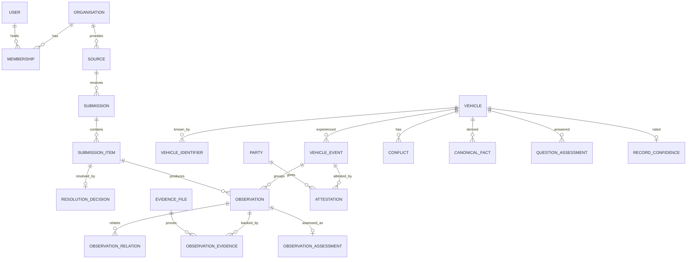

# SAZO Domain Model — v0.2

**Status:** Draft for review · **Date:** 7 October 2026 · **v0.2:** adds fixes G1–G9 found by the Scenario Dataset (marked *[v0.2]*)
**Covers:** core platform modules 1–5 in full (Identity & Access, Vehicle Registry, Ingestion, Observations & Evidence, Trust); modules 6–11 in outline.
**Built on:** SAZO Decisions Log (D-xxx / P-xxx IDs are cited throughout). If this document and the log disagree, the log wins and this document gets fixed.

**What this document is.** It defines the main business concepts ("entities"), what each one means, the rules it must obey, and which module owns it. The database tables, the API and the screens are all derived from it. It is not the SQL schema itself. The schema is the next document, and it must not introduce concepts that aren't defined here.

---

## 0. Big picture

### 0.1 The core idea in one paragraph

Everything SAZO knows about a vehicle starts as an **observation**: one fact, from one **source**, at one **time**, backed (ideally) by **evidence**. Observations are never edited or deleted. The **Trust** module reads all observations about a vehicle and *derives* the current picture: canonical facts, conflicts, confidence and the seven-question assessment. All of that can be recalculated at any time. Reports and screens only ever show derived views, filtered by what each audience is allowed to see.

```
 Source ──(Ingestion: validate, map, resolve vehicle)──▶ Observation (+ Evidence)
                                                           │  append-only, provenance-stamped
                                                           ▼
                                               Trust: assess · detect conflicts · derive
                                                           │  recomputable, versioned rules
                                                           ▼
                                   Canonical facts · Conflicts · Question statuses · Scores
                                                           │  exposure policy applied per audience
                                                           ▼
                                          Reports / Garage / Consoles / API (read models)
```

### 0.2 Modules and data ownership (D-081, D-083)

| # | Module | Postgres schema | Owns |
|---|---|---|---|
| 1 | Identity & Access | `iam` | Users, organisations, memberships, roles, permissions, audit log |
| 2 | Vehicle Registry | `vehicle` | Vehicles, identifiers, resolution decisions, merges |
| 3 | Ingestion | `ingest` | Sources, submissions, validation results, mappings, OCR extractions |
| 4 | Observations & Evidence | `obs` | Observations, events, relations (corrections), evidence files, attestations, the restricted personal-data store (`pii`) |
| 5 | Trust | `trust` | Reputation, assessments, consistency flags, conflicts, canonical facts, question statuses, record confidence |
| 6 | Reports | `report` | Read models: public summary, full report, timeline, saved checks, shares |
| 7 | Garage | `garage` | Garage jobs (drafts → submitted), job lines, customer references |
| 8 | Notifications | `notify` | Outgoing messages, delivery status, templates |
| 9 | Reference & Intelligence | `ref` | Vehicle models, specs, service intervals, price lists, comparables, valuations, forecasts, health scores |
| 10 | Community | `community` | Model reviews, creator links, moderation |
| 11 | Admin & Partner consoles | — (mostly none) | Uses other modules' interfaces; owns only console preferences |

**Golden rule:** a module reads or writes only its own schema. To use another module's data it calls that module's interface or listens to its events.

### 0.3 Conventions used by every module

| Concern | Convention | Why |
|---|---|---|
| IDs | **UUIDv7** for every entity | Unique without coordination, sorts by creation time, safe to generate in an offline app |
| Public references | Short readable codes where people see them: vehicle `SZV-7K3M-9Q2D`, report `SZR-…`, garage job `GJ-…` | UUIDs are unreadable on a phone or over a call |
| Timestamps | `timestamptz`, stored in UTC, shown in East Africa Time | One timeline across all sources |
| Two times per fact | **event time** (when it happened) and **record time** (when SAZO received it) (D-021) | Records often arrive months late |
| Fuzzy dates | Event time plus **precision**: `exact` · `day` · `month` · `year` · `unknown` | Old records often say only "2019" or "March 2021" |
| Money | Integer amount + ISO currency (`UGX`), no decimals for UGX | No rounding errors |
| Distance | Integer **km**; the original unit and value are kept as the source sent them | Japanese imports sometimes report miles |
| Append-only | Business records are never `UPDATE`d or `DELETE`d; changes are new rows | Full history, auditability (D-020) |
| Mutable state | Only for operational objects (drafts, statuses of a case, user profiles). Every change is written to the audit log | Practicality without losing traceability |
| Versioned rules | Every derived value stores the **rule-set version** that produced it | Changing a rule must be explainable and reversible |
| Personal data | Kept only in the restricted `pii` store and referenced by ID elsewhere | Can be protected, encrypted, and deleted on request without breaking history |

---

## 1. Identity & Access (`iam`)

**Purpose:** who someone is, which organisation they act for, and what they may do.

### Entities

**User**: a person who signs in.
- `id`, `display_name`, `phone_e164` (unique, optional), `email` (unique, optional), `status` (`active` · `suspended` · `deleted`), `created_at`
- At least one of phone or email is required.

**AuthIdentity**: a way to sign in.
- `user_id`, `provider` (`password` · `phone_otp` · `google` · `apple`), `subject`, `secret_hash` (passwords only), `verified_at`

**Organisation**: a business or institution acting in SAZO.
- `id`, `type`: `garage` · `dealer` · `inspector` · `inspection_centre` · `police` · `revenue_authority` · `registry` · `lender` · `insurer` · `auction` · `rental` · `manufacturer` · `importer` · `sazo` (SAZO itself)
- `legal_name`, `trading_name`, `registration_number`, `district`, `address`, `contact_phone`, `contact_email`
- `status`: `pending_verification` · `approved` · `rejected` · `suspended`
- `public_profile_enabled`

**VerificationCase**: SAZO's review of an organisation (D-055).
- `organisation_id`, `submitted_documents` (evidence file IDs), `status` (`open` · `approved` · `rejected` · `info_requested`), `reviewer_user_id`, `decision_reason`, `decided_at`
- An organisation can only create records once it is `approved`.

**Membership**: a user acting for an organisation (D-056).
- `user_id`, `organisation_id`, `role_id`, `status` (`invited` · `active` · `removed`), `invited_by`, `joined_at`
- A user can belong to several organisations (e.g. a mechanic who is also a consumer).

**Role** and **Permission**: role-based access.
- A Permission is a code, e.g. `vehicle.report.full.read`, `garage.job.create`, `conflict.resolve`, `submission.create:police`.
- A Role bundles permissions. **Platform roles:** `consumer`, `sazo_admin`, `sazo_reviewer`, `sazo_support`. **Organisation roles:** `org_manager`, `org_staff`, `partner_operator`.

**AuditEntry** (append-only): who did what, when.
- `actor_user_id`, `acting_for_organisation_id`, `action`, `target_type`, `target_id`, `at`, `ip`, `details`

### Rules
- Every action that creates a record carries **(user, organisation, role)**, so every observation can say who entered it and on whose behalf (D-056).
- Suspending an organisation stops new records. Existing records stay, but the source's reputation can be lowered (see Trust).

---

## 2. Vehicle Registry (`vehicle`)

**Purpose:** give every real vehicle exactly one stable SAZO identity, even though the outside world refers to it by many changing numbers.

### Key design choice: the Vehicle is deliberately thin

The `Vehicle` row holds *identity only*. Colour, mileage, owner, make and model are **not** columns on Vehicle. They are observations, and their current values are derived by Trust. That's what makes "never destroy history" possible (D-020, D-031).

### Entities

**Vehicle**
- `id` (UUIDv7, never changes), `public_ref` (`SZV-…`)
- `status`: `active` · `provisional` (only user-provided data so far, P-010) · `merged` (folded into another) · `retired` (exported or scrapped)
- `merged_into_id` (when merged), `created_at`, `created_by_submission_id`

**VehicleIdentifier**: one external number attached to a vehicle, with its own history.
- `vehicle_id`, `type`:
  - `vin` (17-character ISO 3779)
  - `chassis_number` (Japanese-style frame number like `ZSU60-0034817`, often used instead of a VIN)
  - `registration_plate`
  - `engine_number` (for matching only; engine history lives in observations)
  - `import_reference` (customs entry/bill number)
- `value_raw` (exactly as received), `value_normalized` (uppercase, spaces and dashes removed, O→0 rules for VIN)
- `valid_from`, `valid_to`, `time_precision` (event time; e.g. a plate in use from 2021)
- `status`: `active` · `historical` · `disputed`
- `source_observation_id`: the observation that established it (provenance)

**ResolutionDecision**: how an incoming record was matched to a vehicle (append-only).
- `submission_item_id`, `presented_identifiers`
- `outcome`: `matched` · `created_new` · `created_provisional` · `ambiguous` · `rejected`
- `matched_vehicle_id`, `candidate_vehicle_ids`, `rule_applied`, `score`
- `decided_by` (`system` or a reviewer user), `decided_at`

**VehicleMerge** / **VehicleSplit** (append-only)
- Merge: `from_vehicle_id`, `into_vehicle_id`, `reason`, `decided_by`, `at`, `reversed_by_id`
- Split: `source_vehicle_id`, `new_vehicle_id`, `moved_observation_ids`, `reason`, `decided_by`, `at`

### Identity rules

1. **VIN or chassis number is the anchor.** An active normalized VIN or chassis number belongs to at most one active vehicle. A second claim triggers an `identity_conflict` in Trust; it is never silently attached.
2. **Plates are not unique over time.** A plate can move between vehicles (re-issue) and can be faked (cloning). The same plate on two vehicles at once is stored on both and marked `disputed`, and Trust opens a `cloned_plate_suspected` conflict. An official `plate_changed` with a reason is a legitimate change, not a clone *[v0.2, G6]*.
3. **Matching order:** VIN/chassis exact → VIN/chassis fuzzy (one-character slips, I/1 and O/0) → plate in use at the event date + make/model agreement → engine number. Exact anchor matches resolve automatically. Anything fuzzy or ambiguous goes to `ambiguous`, and a reviewer decides.
4. **Search behaviour:** if a plate search matches several vehicles, the user sees all of them and chooses. SAZO never picks one silently. VIN/chassis input with O/I/Q gets a "Did you mean…" suggestion using 0/1 *[v0.2, G9]*. Previous plates stay searchable and are labelled "previous plate".
5. **Engine replacement keeps the vehicle** (D-031). The engine number changes in observations; the vehicle ID and VIN don't.
6. **Merges never move or edit observations.** Observations keep their original `vehicle_id`, and reads follow the `merged_into_id` chain. That makes merges reversible.
7. **Provisional vehicles** come from the "not found" flow (P-010). They become `active` once an independent source corroborates the anchor identifier.

---

## 3. Ingestion (`ingest`)

**Purpose:** the only way data enters SAZO. Whether it's a simulated feed, a partner portal, the Garage app, OCR or a future API, everything goes through the same steps (D-010).

```
Submission (raw, as received) → validate → map to SAZO observation types → resolve vehicle → hand to Observations
```

### Entities

**Source**: where data comes from.
- `id`, `name` (e.g. "URA customs (simulated)"), `organisation_id` (the provider)
- `domain`: `registration` · `customs` · `police` · `finance` · `insurance` · `garage` · `inspection` · `auction` · `rental` · `manufacturer` · `dealer` · `owner` · `community` · `reference`
- `channel`: `simulated_feed` · `partner_portal` · `garage_app` · `inspector_app` · `api` · `file_upload` · `ocr_assisted` · `user_submission`
- `is_simulated` (D-011), `default_evidence_class`, `baseline_reputation`
- `status`: `active` · `paused` · `retired`
- `superseded_by_source_id` (when a real feed replaces a simulated one), `active_from`, `active_to`

**SourceCoverage** *[v0.2, G2]*: what a source can vouch for when it reports *nothing*.
- `source_id`, `domain`, `scope` (`all_registered_vehicles` · `own_customers` · `own_fleet` · `imports_since`), `period_from`, `period_to`
- "No stolen report found" counts as a real negative only where the police source's coverage includes that vehicle and period. Otherwise the answer is "not available".

**Submission**: one envelope of incoming data, stored exactly as received.
- `id`, `source_id`, `submitted_by_user_id`, `acting_for_organisation_id`, `received_at`
- `idempotency_key`: unique per source, so the same submission sent twice is stored once
- `raw_payload` (JSON) or `raw_file_id`, `payload_sha256`, `schema_version`
- `status`: `received` · `validating` · `accepted` · `partially_accepted` · `rejected` · `processed`

**SubmissionItem**: one record inside a submission (a CSV row, one job, one police entry).
- `submission_id`, `sequence`, `raw_item`, `status`, `errors[]`, `warnings[]`, `resolution_decision_id`

**MappingVersion**: how a source's raw format is turned into SAZO observations.
- `source_id`, `version`, `mapping_spec`, `active_from`. Every observation records which mapping version produced it (its transformation history).

**OcrExtraction**: assisted capture (D-027).
- `evidence_file_id`, `engine`, `engine_version`, `raw_output`, `proposed_fields`
- `confirmed_fields`, `confirmed_by_user_id`, `confirmed_at`
- Only *confirmed* fields can become observations. The extraction stays linked to the original file.

### Rules
- **Raw data is kept forever** (subject to retention policy), so any observation can be traced back to exactly what arrived.
- **Validation warns rather than rejects** when the data could be true but looks odd (e.g. mileage lower than before). Consistency is Trust's job; Ingestion rejects only malformed data.
- **Switching simulated → real** (D-011): create the real Source, set the simulated Source to `retired` with `superseded_by_source_id`. Trust's rule set decides whether retired simulated observations still count. The recommended default is **no**: they're excluded from derivation but kept for audit.

---

## 4. Observations & Evidence (`obs`, `pii`)

**Purpose:** the permanent record of everything SAZO has been told about vehicles, and the proof behind it.

### Entities

**Observation**: one fact about one vehicle (append-only). The heart of SAZO.
- `id`, `vehicle_id`, `event_id` (optional grouping), `type` (from the catalogue below), `attributes` (JSON, validated against that type's versioned schema)
- `event_time`, `event_time_precision`, `recorded_at`
- `source_id`, `submission_item_id`, `entered_by_user_id`, `acting_for_organisation_id`
- `evidence_class`: `official` · `garage` · `inspection` · `dealer` · `owner_provided` · `community` (D-026)
- `sensitivity`: `public` · `restricted` · `confidential` (drives exposure)
- `mapping_version`, `schema_version`
- No `updated_at` and no `deleted_at`: by design.

**VehicleEvent**: a real-world happening that produced several observations. For example, one garage job produces an odometer reading, a component replacement, service items and a cost.
- `id`, `vehicle_id`, `type` (`garage_job` · `inspection` · `import` · `registration` · `transfer` · `accident` · `auction_sale` · `finance_change` · `police_report` · `rental_period` · …), `event_time`, `source_id`, `summary_key`
- The timeline shows events; the evidence ledger shows the observations inside them.

**ObservationRelation**: how observations refer to each other (append-only).
- `from_observation_id`, `to_observation_id`
- `kind`: `corrects` (replaces a mistaken value) · `retracts` (withdraws it entirely) · `duplicates` · `corroborates`
- `reason`, `created_by_user_id`, `created_at`
- **Correction rule:** only the original source organisation, or a SAZO reviewer, may correct or retract. The old observation is never altered (D-020).

**EvidenceFile**: a stored file (immutable).
- `id`, `storage_key`, `sha256`, `mime_type`, `size_bytes`
- `kind`: `odometer_photo` · `engine_number_photo` · `plate_photo` · `vehicle_photo` · `receipt` · `invoice` · `part_photo` · `inspection_report` · `official_document` · `other`
- `captured_at` (from the device), `uploaded_at`, `uploaded_by_user_id`, `capture_metadata` (device, GPS if allowed), `retention_class`
- Stored in S3 with write-once settings. The hash proves the file hasn't been altered.

**ObservationEvidence**: links observations to their proof.
- `observation_id`, `evidence_file_id`, `role` (`primary` · `supporting`)

**Attestation**: a third party confirming or disputing an observation or event, e.g. the owner's SMS reply (D-058).
- `target_event_id` or `target_observation_id`
- `attester_kind` (`registered_owner` · `customer` · `inspector` · `organisation`) *[v0.2, G3]*: it is `registered_owner` only when the responder's phone hash matches the current owner Party; otherwise `customer`, which carries less weight. `attester_party_id`
- `channel` (`sms_reply` · `sms_link` · `app`), `response` (`confirmed` · `disputed` · `no_response`), `comment`, `responded_at`

**Party** (in the restricted `pii` schema): a person or business referred to *in* records (owners, garage customers), as opposed to users who sign in.
- `id`, `kind` (`person` · `business`), `name` (encrypted), `phone_e164` (encrypted), `phone_hash` (for matching without decrypting), `national_id_hash` (optional), `created_at`, `erasure_requested_at`
- Observations refer to `party_id`, never to names or phone numbers directly.
- **Why:** consumer views show "2 owners", not who they were (P-007). Personal data stays in one protected place. A data-protection request can erase the Party's details while the vehicle history stays intact. Legal confirmation is pending (P-013).

### Observation type catalogue (MVP)

| Domain | Types |
|---|---|
| Identity & spec | `identifier_assigned` (VIN/chassis/plate/engine number), `spec_declared` (make, model, year, body, engine size, fuel, transmission, colour) |
| Import & registration | `import_recorded` (origin country, port, date, export mileage, auction grade), `customs_cleared`, `registration_issued`, `plate_changed` (old, new, **reason**: `replacement` · `re_registration` · `personalised` · `correction` *[v0.2, G6]*), `deregistered` |
| Ownership & use | `ownership_transferred` (from/to Party), `usage_declared` (private / commercial / rental / PSV), `rental_period` |
| Mileage | `odometer_reading` (km plus `original_value` and `original_unit`, km or miles *[v0.2, G7]*, reading method) |
| Maintenance | `service_performed` (items, parts, labour), `component_replaced` (component incl. `engine`, `transmission`, `instrument_cluster`; old/new serial; for an instrument cluster also `reading_before`/`reading_after` *[v0.2, G1]*; reason), `repair_performed`, `paint_work` (areas, old/new colour, reason) |
| Damage & safety | `accident_reported`, `damage_assessed` (areas, severity, structural yes/no), `insurance_claim`, `total_loss_declared`, `flood_damage_reported` |
| Legal & finance | `stolen_reported`, `stolen_recovered`, `impounded`, `released`, `finance_lien_registered`, `finance_lien_discharged` |
| Inspection | `inspection_result` (checklist sections, paint readings, tyres, battery, pass/fail, defects) |
| Market | `listing_published` (dealer asking price), `sale_recorded` (price, where allowed), `auction_sale` |
| Cost | `cost_recorded` (amount paid for a job; restricted) |

Each type has a versioned attribute schema, shared as Zod schemas between the backend and the apps. New types are added by adding to the catalogue, without changing the database structure.

### Rules
- **One fact, one observation.** A garage job that records mileage and an engine swap produces at least two observations under one event.
- **Required evidence is enforced at Ingestion** (D-057): `odometer_reading` from a garage needs an `odometer_photo`, and `component_replaced` for an engine needs an `engine_number_photo`.
- **Sensitivity defaults by type:** `cost_recorded` and any `ownership_transferred` party details are `confidential`; `finance_lien_*` and police types are `restricted`. The exact exposure levels are O-001.

---

## 5. Trust (`trust`)

**Purpose:** turn the pile of observations into a judgement: what's currently true, how sure we are, what disagrees, and how to answer the seven buyer questions. Everything here is **derived and recomputable** (D-022), and every output records its `rule_set_version`.

### Entities

**RuleSet**: a versioned package of trust rules (weights, thresholds, check definitions).
- `version`, `description`, `activated_at`, `activated_by`
- Changing a rule means creating a new version, so old outputs remain explainable.

**SourceReputation**: how much SAZO trusts a source right now.
- `source_id`, `score` (0–1), `factors` (baseline, verification status, dispute rate, correction rate, attestation confirmations), `rule_set_version`, `effective_from`
- Garages earn reputation through confirmed records and lose it through disputes (D-055).

**ObservationAssessment**: confidence in one observation, with its reasons (D-024).
- `observation_id`, `confidence` (0–1)
- `factors`: e.g. `{ source_reputation: 0.8, evidence: +0.1 (odometer photo), corroboration: +0.05 (2 agreeing), attestation: +0.1 (owner confirmed), consistency: −0.3 (lower than previous reading), age: 0 }`
- `excluded` (true if retracted, superseded or from a retired simulated source) + `exclusion_reason`
- `rule_set_version`, `computed_at`

**ConsistencyFlag**: the result of an automatic check (D-059).
- `vehicle_id`, `check`: `mileage_decrease` (not raised across a declared instrument-cluster replacement, *[v0.2, G1]*) · `implausible_mileage_rate` · `plate_vin_mismatch` · `undeclared_engine_change` · `duplicate_suspected` · `identity_collision` · `cloned_plate_suspected` · `date_impossible` (e.g. a service before import)
- `severity` (`info` · `attention` · `serious`), `observation_ids[]`, `rule_set_version`, `raised_at`, `cleared_at`

**Conflict**: a disagreement worth a decision (D-023).
- `id`, `vehicle_id`, `topic` (`mileage` · `identity` · `ownership` · `damage` · `finance` · `spec` …), `observation_ids[]`, `opened_from_flag_id`
- `status`: `open` · `auto_resolved` · `under_review` · `resolved` · `dismissed`
- `resolution`: chosen interpretation, `reasoning`, `resolved_by` (`system` + rule version, or a reviewer user), `resolved_at`
- **ConflictActivity** (append-only): every status change, assignment and comment.

**CanonicalFact**: SAZO's current best answer for one fact about a vehicle.
- `vehicle_id`, `key`:
  - `make` · `model` · `year` · `body` · `engine_size` · `fuel` · `transmission`
  - `registered_colour` · `current_colour` · `current_plate` · `registered_engine_number` · `current_engine_number` · `current_mileage_km` *[v0.2, G8]*
  - `title_status` (`clean` · `total_loss` · `rebuilt`) *[v0.2, G5]*
  - `owner_count` · `usage_type`
  - `finance_status` · `stolen_status` · `import_origin` · `first_registration_date`
- `value`, `confidence`, `supporting_observation_ids[]`, `conflicting_observation_ids[]`, `rule_set_version`, `derived_at`

**QuestionAssessment**: the answer to one of the seven buyer questions (D-041).
- `vehicle_id`, `question` (`identity` · `care` · `damage` · `mileage` · `provenance` · `legal_financial` · `valuation`)
- `status` (`verified` · `attention` · `serious` · `not_available`)
- `headline_key` + `params`: a message template, so wording rules (P-006) live in one place
- `coverage` (records and sources counted), `basis_observation_ids[]`, `rule_set_version`

**RecordConfidence**: how complete and well-supported the vehicle's record is overall (P-001).
- `vehicle_id`, `level` (`high` · `medium` · `low` · `insufficient`), `score`, `factors` (record count, source diversity, evidence coverage, open conflicts, time gaps), `rule_set_version`
- *Vehicle Health*, which describes the car's condition, belongs to Reference & Intelligence (module 9). It reads Trust outputs but is a separate score.

### How recomputation works
1. Observations publishes `ObservationRecorded` (or `…Corrected`, `AttestationReceived`, `VehiclesMerged`).
2. Trust queues **one recompute job per vehicle**. Bursts are combined, e.g. a garage job that creates 6 observations triggers one recompute.
3. The job loads every observation for the vehicle (following merges), applies the active rule set **as of a stated time** (stored with every output, so results can be reproduced; *[v0.2, G4]*), and writes a new set of assessments, flags, conflicts, canonical facts and question statuses.
4. Trust publishes `VehicleAssessmentUpdated`. Reports refreshes its cached views.
5. A **full rebuild** (all vehicles) can run after any rule change. This is the practical proof that derivation is recomputable.

### Key rules
- **Missing data never looks good** (D-062): a question with no qualifying observations is `not_available`, never `verified`. `verified` needs a minimum coverage defined in the rule set; the default is at least 2 independent records or 1 official record.
- **Conflicts are not silently resolved.** The system may auto-resolve only by an explicit rule (e.g. a later correction from the same source), and it records which rule did so.
- **Excluded observations still show** in the evidence ledger, marked as excluded and why. They just don't count towards derived values.

---

## 6–11. Other modules (outline)

| Module | Main concepts | Notes |
|---|---|---|
| **6 Reports** (`report`) | `PublicSummaryView`, `FullReportView`, `TimelineView`, `SavedCheck`, `SharedLink`, `ReportSnapshot` (frozen copy for PDF/share), `ExposurePolicy` (observation type × attribute × audience → full / summarised / hidden) | Pure read models built from Trust and Observations. **Exposure filtering happens on the server**, before data reaches the browser. |
| **7 Garage** (`garage`) | `GarageJob` (draft → submitted; holds offline-created drafts), `JobLine` (work items), `JobCustomer` (Party ref + consent), `GarageVehicleList` | **On submit, a job becomes a Submission to Ingestion through the `garage_app` channel.** The Garage module never writes observations directly. That keeps one path for all data (D-010). |
| **8 Notifications** (`notify`) | `OutboundMessage`, `DeliveryStatus`, `Template`, `InboundReply` | Sends the owner confirmation SMS; inbound replies become Attestations via Observations. |
| **9 Reference & Intelligence** (`ref`) | `VehicleModel` (make/model/generation/trim), `ServiceInterval`, `PriceListItem`, `MarketComparable`, `ModelGuidance`, `Valuation`, `MaintenanceForecast`, `VehicleHealth` | Reference data is versioned and has its own sources (D-015). Valuation/forecast/health store their inputs, rule versions and explanation factors (D-060–D-062). |
| **10 Community** (`community`) | `ModelReview`, `CreatorLink`, `ModerationCase` | Attached to `VehicleModel`, never to a Vehicle (D-063). Links go through moderation before publishing (P-008). |
| **11 Admin & Partner consoles** | — | Screens over the other modules: organisation approvals, the conflict review queue, moderation, data-entry by domain (creates Submissions), simulated-source management. |

---

## 7. Events between modules (MVP)

Events are written to the publishing module's outbox in the same database transaction as the change, then delivered (D-081).

| Event | Published by | Consumed by |
|---|---|---|
| `OrganisationApproved` / `Suspended` | Identity & Access | Ingestion (enable sources), Trust (reputation) |
| `SubmissionAccepted` | Ingestion | Observations |
| `VehicleCreated` / `VehiclesMerged` / `VehicleSplit` | Vehicle Registry | Trust, Reports |
| `ObservationRecorded` / `ObservationCorrected` | Observations | Trust, Reference & Intelligence |
| `AttestationRequested` | Observations | Notifications |
| `AttestationReceived` | Observations | Trust |
| `ConflictOpened` / `ConflictResolved` | Trust | Reports, Admin console, Notifications (later) |
| `VehicleAssessmentUpdated` | Trust | Reports, Reference & Intelligence |
| `GarageJobSubmitted` | Garage | Ingestion |

---

## 8. Walkthroughs: the model against hard cases

**A. Garage replaces an engine on UBK 482M**
1. The garage app creates a `GarageJob` draft offline.
2. On submit, it becomes a Submission (`garage_app` channel).
3. Ingestion validates it and checks the required evidence: an odometer photo and an engine-number photo.
4. Ingestion resolves the plate to the vehicle.
5. Observations creates one `VehicleEvent(garage_job)` holding:
   - `odometer_reading 151,870 km`
   - `component_replaced {engine, old: 1NZ-…, new: 1NZ-…}`
   - `service_performed`
   - `cost_recorded` (confidential)
   - the evidence links
6. Observations publishes `AttestationRequested`, and Notifications texts the owner.
7. Trust recomputes:
   - `current_engine_number` changes.
   - The `undeclared_engine_change` flag does not fire, because the change is declared.
   - The mileage check passes.
8. The VIN and vehicle ID are unchanged, and the old engine stays in history.

**B. Cloned plate**
1. A police record has UAX 123A on a white Premio (chassis `NZT260-30…`), and a garage record has UAX 123A on a silver Harrier (chassis `ZSU60-…`) in the same month.
2. Two vehicles end up holding the same `registration_plate` identifier at overlapping times. Both are marked `disputed`.
3. Trust flags `cloned_plate_suspected` and opens a Conflict.
4. A plate search shows both vehicles with a Serious banner, and the user chooses.
5. A reviewer resolves the Conflict, recording the reasoning.

**C. Mileage rollback**
1. Readings: 98,000 km (garage, Mar 2025) after 120,000 km (auction, Jan 2024).
2. Trust raises the `mileage_decrease` flag (serious) and opens a Conflict.
3. The mileage question shows `serious` ("A reading is lower than an earlier record"), and both observations stay visible with their sources.

**D. Real URA feed replaces the simulated one**
1. The new Source "URA customs" goes active, and "URA customs (simulated)" is retired with `superseded_by`.
2. The rule set excludes observations from retired simulated sources.
3. A full rebuild runs, and the reports change without any code or schema change (D-011).

**E. Duplicate vehicles discovered**
1. A plate-only provisional vehicle and a VIN-anchored vehicle turn out to be the same car.
2. A reviewer records a `VehicleMerge`. Observations keep their original `vehicle_id`, and reads follow the merge.
3. Trust recomputes the surviving vehicle. If the merge was wrong, it's reversed with a new record.

**F. Owner disputes a garage record**
1. The SMS reply is "2". The Attestation is recorded as `disputed`.
2. The assessment for that event's observations drops, and an `ownership`- or `mileage`-topic Conflict may open.
3. The garage's dispute rate feeds its SourceReputation.

---

## 9. Core relationships (diagram)



---

## 10. Decisions this model introduces (to confirm)

| # | Proposal | Recommendation |
|---|---|---|
| DM-1 | The Vehicle row holds identity only; every attribute is an observation with a derived current value | **Yes.** This is what makes history and corrections work |
| DM-2 | Personal data lives only in a restricted `pii` store, referenced by ID | **Yes.** Privacy, erasure requests, P-007 |
| DM-3 | Observation attributes are JSON validated against a versioned type catalogue (not one table per type) | **Yes for MVP.** New record types need no database change. Trust builds typed projections (e.g. a mileage series) where speed matters |
| DM-4 | The Garage module submits through Ingestion rather than writing observations directly | **Yes.** One path for all data |
| DM-5 | Observations from retired simulated sources are excluded from derived values but kept | **Yes** |
| DM-6 | "Verified" needs ≥ 2 independent records or 1 official record (default; tunable in the rule set) | **Yes, as a starting rule** |
| DM-7 | Merges are reversible and never move observations | **Yes** |
| DM-8 | UUIDv7 IDs plus short public reference codes | **Yes** |

## 11. Still open (affects this model)

- **O-001:** exactly which finance and police attributes each audience sees. This fills in `ExposurePolicy`; the model doesn't change.
- **O-007:** how an owner proves ownership. It will add an `OwnershipClaim` concept linking a User to a Vehicle with evidence.
- **P-013:** data residency, and how long personal data is kept. This affects the `pii` store's retention and hosting.
- Whether sale prices are recorded and shown (they affect valuation quality; commercially sensitive).

## 12. Next documents

1. ~~Scenario dataset~~: done (`SAZO Scenario Dataset.md`, 26 scenarios); its gaps G1–G9 are folded into this v0.2.
2. **Database schema v0.1:** tables per schema, keys, indexes, constraints, derived from this model.
3. **Rule set v1:** confidence factors and weights, consistency checks, question-status rules, record-confidence formula.
4. **API outline:** module interfaces and the public REST endpoints for the first slice.
